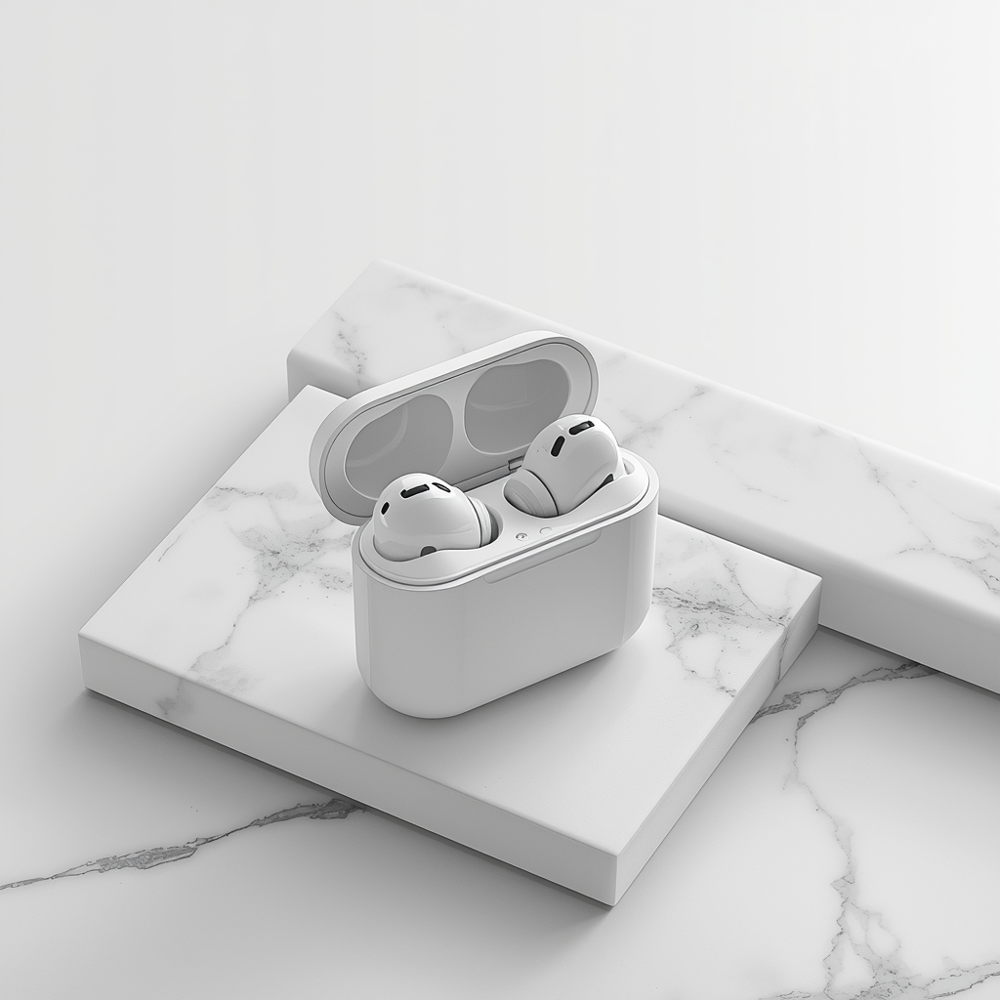

# Objective

## Create prompts for models that generate images.

## Step 1: Write a descriptive prompt for an image model

```
Prompt:

A product on a table
```

Output:

https://github.com/Jbishop-cyber/Prompt-Piscine/blob/main/quest%209/creative-ai/lucid-origin_A_sleek_modern_product_with_a_metallic_finish_and_rounded_edges_sits_centered_on-0.jpg

## Step 2: Refine the prompt by adding constraints such as art style, colors, or perspective.

```
Prompt:

Wireless earbuds in charging case on minimalist white marble surface, clean product photography, soft diffused studio lighting from above, white background, high key lighting, professional e-commerce style, sharp focus, high resolution
```

Output:


## Step 3: Compare results between a vague prompt and a refined descriptive prompt.

The weak prompt produced a vague, generic and random result because it lacks clarity. The AI model had to make assumptions about the kind of product to produce and the overall style, which led to an inconsistent and an uncontrolled output. But the refined prompt generated a clean image because it was well detailed. The object was specified, the surface material and the color of the surface material was also specified, the lighting and photography style were described. All these details helped the model to reduce the ambiguity and guided it to produce a more precise result.
